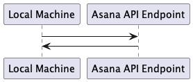

   <!-- Copyright 2020 SJULTRA, inc.

   Licensed under the Apache License, Version 2.0 (the "License");
   you may not use this file except in compliance with the License.
   You may obtain a copy of the License at

       http://www.apache.org/licenses/LICENSE-2.0

   Unless required by applicable law or agreed to in writing, software
   distributed under the License is distributed on an "AS IS" BASIS,
   WITHOUT WARRANTIES OR CONDITIONS OF ANY KIND, either express or implied.
   See the License for the specific language governing permissions and
   limitations under the License. -->

# Build a web app using Asana api calls using nodejs

In this how-to, we will be building a simple "Hello World" app using Node.js to connect to the Asana API, grab the full name of the user, and display that back into the console. 



## Step 1: Register an account at Asana

It's free, so head over to https://Asana.com and register for an account. There is a free tier and you do not need to provide any information except your email and name. 

## Step 2: Get your personal access token (PAT)

1. Once you are logged in, navigate to your settings (click your initials in the upper-right corner) and chose "My Settings...". 
1. From there navigate to "Apps", then at the bottom of "Apps", you will find a link to "Manage Developer Apps", click on that. It will take you to a devoper portal (https://app.asana.com/0/my-apps), and from there you will see "Personal Access Tokens" near the bottom. 
1. Click the "Create new token" button at the bottom, and give Asana a brief description of what you are going to be doing with the token, as well as agree to terms. 
1. Once you have done that, Asana will provide a long string of characters and prompt you to copy and store your token (do NOT put this in any code that you deploy to Azure/GitHub/GitLabs, etc.).

## Step 3: Prepare your computer for Node.js

1. Navigate to https://nodejs.org/en/ and follow the correct instructions for you computer. On a Mac, the easiest method is to use HomeBrew to install node (brew install node). 
1. Validate you can run npm on the command line (npm), this will make sure that Node.js is installed and in your path. 

## Step 4: Build your app

1. Navigate over to https://developers.asana.com/docs/node-hello-world to find a Node.js example of a simple hello world app, that grabs your name (the name you provided in Step 1 above), and outputs that in a "Hello World" statement. This confirms that we are connecting to the Asana API, grabbing details about the user associated to your access token (PAT), and outputing that in the command line. 

    ```javascript
    var asana = require('asana');

    // replace with your personal access token. 
    var personalAccessToken = '0/123456789....';

    // Construct an Asana client
    var client = asana.Client.create().useAccessToken(personalAccessToken);

    // Get your user info
    client.users.me()
    .then(function(me) {
        // Print out your information
        console.log('Hello world! ' + 'My name is ' + me.name + '!');
    });
    ```
We need to change the access token (where it says "var personalAcessToken = ...;"), and use the access token provided by Asana in step #2 above. 

## Step 5: Test your app

1. From the command line, run the following from the directory where you have saved your .js file fro step #4. 

    ```
    % node hello_world.js
    ```

1. It will output the following:

    ```
    Hello world! My name is John Smith!
    ```

If that happens, then you have successfully created a Node.js app that connects to the Asana API, time to celebrate!

## Further Reading

If you want to take this further, the API is feature rich and there is a lot you can do with it. To get started first head to https://developers.asana.com/docs and start reading through the documentation. It is well laid out and easy to digest, and even has a web based API explorer you can play around with, found at https://developers.asana.com/explorer. 

Asana also keeps all of there examples on GitHub. You can find the link to the Node.js repository here https://github.com/Asana/node-asana, and specifically examples of using Asana and Node.js under the examples directory. Note, there have been some recent API changes, and it is likely that not all of there examples work the same way, so keep that in mind. 

Enjoy and good luck!