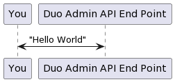

   <!-- Copyright 2020 SJULTRA, inc.

   Licensed under the Apache License, Version 2.0 (the "License");
   you may not use this file except in compliance with the License.
   You may obtain a copy of the License at

       http://www.apache.org/licenses/LICENSE-2.0

   Unless required by applicable law or agreed to in writing, software
   distributed under the License is distributed on an "AS IS" BASIS,
   WITHOUT WARRANTIES OR CONDITIONS OF ANY KIND, either express or implied.
   See the License for the specific language governing permissions and
   limitations under the License. -->

[go back](../Getting-Started)

Duo is a very popular 2fa application used by many companies to protect enterprise resources and applications. Below, we will be testing the Duo API with a very simple example. Duo makes this super easy, and the documentation is pretty good. We will be uing Javascript (specifically Node.js) to test an API end-point, but there is documentation and samples for a variety of languages.

Here is a simple diagram showing how we will interact with the Duo API:



## Step 1: Get your Duo developer account

Sign up for a free Duo Trial Account [here](https://signup.duo.com/). You will need to use an email you can reach (to validate your account), and have your smartphone to install the Duo app.

## Step 2: Login to the Duo developer dashboard

Login to the Duo admin panel [here](https://admin.duosecurity.com/), and navigate to "Applications".

## Step 3 Protect the Admin API Application

For purposes of this tutorial chose Duo "Admin API" and click on Protect. Once you chose to protect the "Admin API", you will be taken into the details for this application. Note, you can chose to protect this app, or any application in the list as many times as you like and provide unique names to each one.

## Step 4 Note the details

Once you are in the details of your Admin API application, note a few things we need to setup or note:

1. Integration key - you will need this in the command line when we call the Duo Admin API
2. Secret key - you will need this in the command line when we call the Duo Admin API
3. API hostname - you will need this in the command line when we call the Duo Admin API
4. Under Permissions, you need to grant read permissions, so check the box next to `Grant read information`.

We will also need a test program provided by Duo for Node.js. Download the zip file from Duo's github page [here](https://github.com/duosecurity/duo_api_nodejs). Click the green "Code" button, and either clone the repository, or just download the zip file. In the repository, under `example`, you will find a javascript file called `duo_admin.js`.

## Step 5 Assemble your details into the command line

From the command line, we will execute the following command, using our assembled details from [step #4](#step-4-note-the-details).

```shell
node duo_admin.js --ikey your_integration_key --skey your_secret_key --host your_api_host_name
```

## Step 6 Execute the test

From where you downloaded (or cloned) the repository, you will execute the following:

```shell
node duo_admin.js --ikey your_integration_key --skey your_secret_key --host your_api_host_name
```

There will be one of two outcomes:

1. The API returns a failure, which looks like:

    `API call returned error: Access forbidden`

    This is due to missing the permissions step in [step 4](#step-4-note-the-details), the API needs (at minimum) read permissions to your "application" in order to use it. Go back to your application and check the box as outlined above. Then rerun [step 6](#step-6-execute-the-test).

2. The API returns a success, which looks like:

    ```shell
    mintime = 1657483539
    maxtime = 1660075539
    ERROR count = 0
    FAILURE count = 0
    FRAUD count = 0
    SUCCESS count = 0
    ```

## Further reading

There are a LOT more API endpoints you can test, for a variety of applications that Duo supports. What we did above is just scratching the surface. To explore the API end points, navigate over to <https://duo.com/docs/authapi#endpoints>, and start playing. Don't forget the example we used above can be found on the Duo GitHub page [here](https://github.com/duosecurity/duo_api_nodejs).
