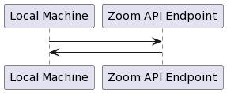

   <!-- Copyright 2020 SJULTRA, inc.

   Licensed under the Apache License, Version 2.0 (the "License");
   you may not use this file except in compliance with the License.
   You may obtain a copy of the License at

       http://www.apache.org/licenses/LICENSE-2.0

   Unless required by applicable law or agreed to in writing, software
   distributed under the License is distributed on an "AS IS" BASIS,
   WITHOUT WARRANTIES OR CONDITIONS OF ANY KIND, either express or implied.
   See the License for the specific language governing permissions and
   limitations under the License. -->

[go back](../Getting-Started)

# Build a web app using Zoom api calls using nodejs

We will be using the Zoom SDK and API in this tutorial to build a simple "hello world" app. This tutorial will see us scheduling a zoom call, connecting using the desktop app (or web app), and also connecting a 2nd party using the Zoom API. It's easy to do, and straight forward, as well as instructive about how simple Zoom is to work with. Below, we have included a simple diagram of how we will be connecting to the API.



## Step 1: Get your house in order (pre-requisites)

You will need Node.js for this, which is easy to get for your platform. Navigate your browser to Node's [site](https://nodejs.org/en/) and download for your system. Otherwise, that's it!

## Step 2: Sign-up for a developer account

We will need a Zoom developer account, you can sign up for a free one [here](https://developers.zoom.us/). Once you have it, sign in and make sure you are able to access the your developer account.

## Step 3: Download meetingsdk-web-sample

We will need a sample app from Zoom for Node.js in order to connect to the Zoom API. You can download this sample from Zoom's GitHub site [here](https://github.com/zoom/meetingsdk-web-sample). You can download the zip file and unpack it, or clone the repository, either way is fine for this tutorial.

## Step 4: Create your test app

You will find your SDK key, and secret key from the Zoom developer dashboard:

1. Navigate to: <https://marketplace.zoom.us/>
2. Click on "Manage"
3. Click on "Develop"
4. Click on "Build App"
5. Click on "SDK" *NOTE: JWT apps are being deprecated in June 2023*
6. Fill in required information (put in whatever you like here, it's not important for this tutorial)
7. Find your "SDK" credentials, we need the key and secret, note those down somewhere

## Step 5: Modify your project

We need to change two lines in the index.js file from the meetingsdk-web-sample repository.

Add your keys to `meetingsdk-web-sample/local/index.js` from [Step 4](#step-4-create-your-test-app):

```javascript
const SDK_KEY = "YOUR_SDK_KEY";
const SDK_SECRET = "YOUR_SDK_SECRET";
```

In the `meetingsdk-web-sample` repository there are three sub directories:

1. /local
2. /CDN
3. /component

For purposes of this tutorial, we will be using local. But, /local and /CDN are essentially the same, and /component uses a different port. Essentially, /local is to be used with the desktop application and web application, whereas /component is for embedding Zoom into an iframe or another page element.

## Step 6: Run your program

1. Navigate to where you downloaded the meetingsdk-web-sample repository (e.g.,`meetingsdk-web-sample/local`)
2. Run `npm install` to make sure you have all the right packages
3. Run `npm start` to run the program and open up the port (localhost:9999)

You will see something like the below:

```shell
> websdk-local@2.6.0 start
> set NODE_ENV=development && set BABEL_ENV=development && node corp.js --corp

https false
disableCORP false
[HPM] Proxy created: /meeting.html  ->  http://127.0.0.1:9998/
ℹ ｢wds｣: Project is running at http://0.0.0.0:9999/
ℹ ｢wds｣: webpack output is served from /static
ℹ ｢wds｣: Content not from webpack is served from /Users/seanfay/dev/iben/meetingsdk-web-sample/Local
ℹ ｢wds｣: 404s will fallback to /index.html
Listening at http://127.0.0.1:9999/index.html
ℹ ｢wds｣: Project is running at http://0.0.0.0:9998/
ℹ ｢wds｣: webpack output is served from /static
ℹ ｢wds｣: Content not from webpack is served from /Users/seanfay/dev/iben/meetingsdk-web-sample/Local
ℹ ｢wds｣: 404s will fallback to /index.html
Listening at http://127.0.0.1:9999/index.html
ℹ ｢wdm｣: asset index.min.js 6.68 MiB [emitted] (name: index)
asset meeting.min.js 6.68 MiB [emitted] (name: meeting)
runtime modules 51.7 KiB 26 modules

...

ℹ ｢wdm｣: Compiled successfully.
ℹ ｢wdm｣: Compiling...
ℹ ｢wdm｣: Compiling...
ℹ ｢wdm｣: assets by status 13.4 MiB [cached] 2 assets
cached modules 6.47 MiB (javascript) 51.7 KiB (runtime) [cached] 66 modules
./js/index.js 4.85 KiB [built]
webpack 5.28.0 compiled successfully in 247 ms
ℹ ｢wdm｣: Compiled successfully.
ℹ ｢wdm｣: assets by status 13.4 MiB [cached] 2 assets
cached modules 6.47 MiB (javascript) 51.7 KiB (runtime) [cached] 66 modules
./js/index.js 4.85 KiB [built]
webpack 5.28.0 compiled successfully in 291 ms
ℹ ｢wdm｣: Compiled successfully.
```

Point your browser to <http://0.0.0.0:9999/>

You will see the Zoom SDK test application, showing what name will be used when this client connects to your Zoom call (that you will schedule in the next step), inputs for meeting number, password, email, and role (attendee/host).


## Step 7: Join a scheduled meeting using the sample app

From the Zoom web interface (<https://zoom.us/meeting/schedule>), schedule a meeting. Note the meeting number as we will use it shortly. Join the meting as the host using the desktop app, or the web version (either works).

From the Zoom WebSDK (<http://0.0.0.0:9999/>), input your meeting number and a password if you set one. Then join it!

## Step 8: Celebrate

If everything worked you should see your self twice, one will be the name in the field to the far left in the Zoom WebSDK (e.g., Local2.6.0Mac#chrome/...) and the host session.

## Further Reading

From the Zoom developer docs, there are other tools you can build (e.g., chatbots, zoom marketplace apps, video based apps, etc.), you can see that [here](https://marketplace.zoom.us/docs/guides/). So, have some fun and build something extra special using the API and SDK that Zoom has to offer.
